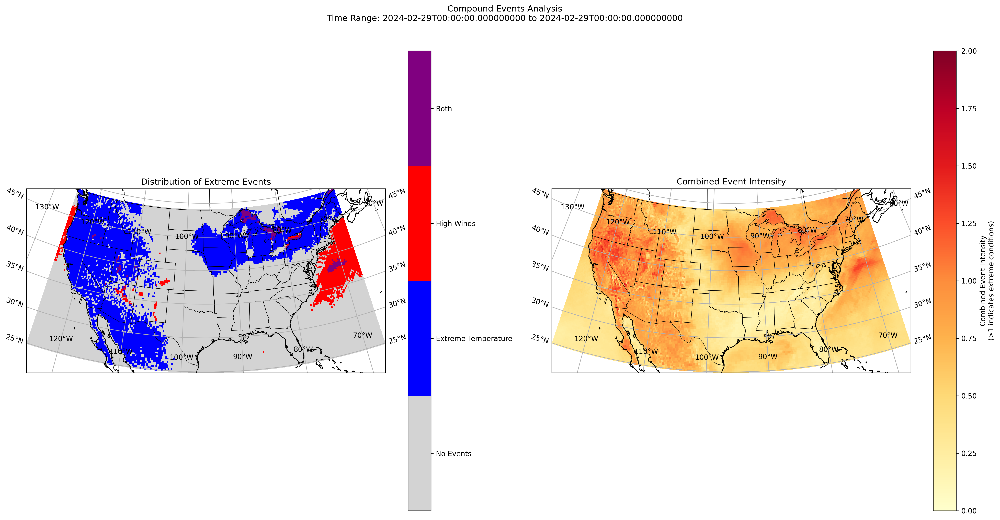

### Overview
This project implements a Python application for processing and analyzing ECMWF forecast data, focusing on temperature anomalies and extreme weather conditions.

### Features

#### Data Processing
- Fetches ECMWF (European Centre for Medium-Range Weather Forecasts) forecast data
- Processes WeatherBench2 climatology data for historical context
- Handles global temperature and wind data at high resolution

#### Analysis Capabilities
- Calculates temperature anomalies globally
- Identifies extreme weather events for example wind_speed
- Detects compound events (multiple extreme conditions occurring simultaneously)
- Processes wind patterns and their relationship to temperature changes

#### Visualization & Output
- Generates publication-quality maps and plots
- Creates detailed CSV reports of extreme event locations
- Visualizes temperature anomalies with wind overlay
- Produces compound event analysis maps

#### Technical Features
- Efficient data caching system
- AWS S3 integration for data storage (optional)
- Parallel processing for faster analysis
- Automated quality control checks

   

### Features Implemented
- Efficient loading of ECMWF IFS forecast data (0.25-degree resolution)
- Temperature anomaly calculation using WeatherBench2 climatology
- Identification of extreme weather conditions:
- Wind speeds exceeding 15 m/s
- Temperature anomalies beyond ±5 K
- Visualization with Lambert Conformal projection for US

### Technical Implementation

#### Data Access Strategy
1. **S3 Access Implementation**
   - Configured boto3 with retry logic (max_attempts=3)
   - Anonymous access fallback for public data
   - Structured data access with prefix patterns

2. **GCP Access**
   - Used gcsfs for WeatherBench2 climatology data
   - Implemented zarr format access
   - Lazy loading with xarray

#### Performance Optimizations
1. **Local Caching**
   - Implemented cache directory for downloaded files
   - Files only downloaded if not in cache
   - Cache persists across sessions

2. **Memory Management**
   - Lazy loading with xarray/dask
   - Selective variable loading using GRIB filter_by_keys
   - 6-hourly timesteps instead of hourly data

### Installation Guide

1. **Environment Setup**
```bash
# Create virtual environment
python -m venv .venv
source .venv/bin/activate 

# Install dependencies
pip install -r requirements.txt
```

2. **Configure Environment**
```bash
# Edit .env with your credentials 
AWS_ACCESS_KEY_ID=your_access_key
AWS_SECRET_ACCESS_KEY=your_secret_key
```

### Running the Analysis

2. **Run Complete Analysis**
```bash
python main.py
```

### Analysis Results


#### Temperature Anomalies (Continental US)
- Analysis Period: February 29, 2024 - March 6, 2024
- Total extreme locations: 7,031 grid points


#### High Wind Events

- Total high wind locations: 1,321 grid points


#### Compound Events

- Locations with both extreme temperature and high winds: 18

